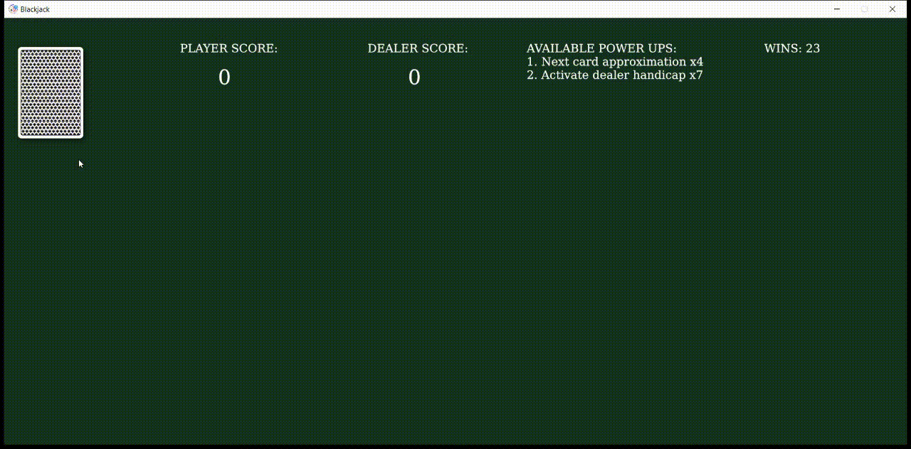

# Blackjack
A simple [Blackjack](https://bicyclecards.com/how-to-play/blackjack/) game on Rust using the [ggez](https://github.com/ggez/ggez) framework. You play 1vs1 against the dealer with standart blackjack rules, but there are added "power-ups" to help you win.

Execute with `cargo run --release` for better performance.
